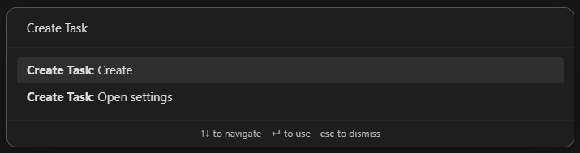
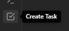

<h1 align="center">Create Task</h1>

Faster creation of tasks in Obsidian.

  <a href="#features--why">Features & Why</a> • <a href="#install">Install</a> • <a href="#usage">Usage</a> • <a href="#contributing">Contributing</a>

  

  

## Features & Why

Create Task was made to improve the creation of tasks in Obsidian. It won't handle the task management after the creation since there are already many other plugins like [CardBoard](https://github.com/roovo/obsidian-card-board) and [Tasks](https://github.com/obsidian-tasks-group/obsidian-tasks).

The main feature of this plugin is a modal which guides you through the individual steps of creating a task. You can open this modal in many different ways (see [Usage](#usage) for more details).

- You can configure multiple _target notes_. Other plugins usually save all tasks in a single note. For my use case I want to store the tasks in different notes depending on the project I'm working on.
- You can configure a tag which will get appended to the created tasks. This is helpful when using the CardBoard plugin since their columns are tag-based.
- You can create tasks with a due date and use [natural language](https://github.com/wanasit/chrono) for defining the these. You can also configure the output format since other plugins use different formats for handling dates.

## Install

1. Download the [latest release](https://github.com/simonknittel/obsidian-create-task/releases/latest/download/obsidian-create-task.zip)
2. Extract the `.zip` file
3. Move the extracted directory into your vault's plugin directory (`.obsidian/plugins/`)
4. Restart Obsidian
5. Enable the plugin

## Usage

### Command palette

You can use Obsidian's [command palette](https://help.obsidian.md/Plugins/Command+palette) to open the modal or this plugin's settings.

### Ribbon menu

You can open the modal by clicking this plugin's icon in [Obsidian's ribbon menu](https://help.obsidian.md/User+interface/Ribbon).

### URL scheme / Obsidian URI

This plugin supports the [URL scheme/Obsidian URI standard](https://help.obsidian.md/Extending+Obsidian/Obsidian+URI).

Using this url (`obsidian://create-task`) will automatically start Obsidian and open the modal.

You can use parameters to prefill parts of the modal:

- This prefills the Target note input: `note-path=Unsorted%20TODOs.md`
- This prefills the Task description input: `task-description=Do%20stuff`
- This prefills the Task details input: `task-details=More%20info`
- This prefills the Due date input: `due-date=tomorrow`
- This will skip the modal and immediately create the task in the specified note: `create=true`

#### Examples

Here are some examples of where you could use the url:

##### Raycast

1. Open Raycast
2. Search for `Create Quicklink`
3. Fill out the form
   - Name: Create task
   - Link: `obsidian://create-task`
   - Open With: `Obsidian`
4. Save the Quicklink
5. Now you can open Raycast and search for `Create task` in order to start Obsidian and open the modal.

##### Windows Start Menu/Search

1. Create a Windows Shortcut in `C:\Users\<your-username>\AppData\Roaming\Microsoft\Windows\Start Menu\Programs`
2. For `Type the location of the item` use the url: `obsidian://create-task`
3. For `Type the name of the item` use: `Create task`
4. Save the shortcut
5. Now you can use the Windows Search and search for `Create task`. You can also pin this shortcut to the Start Menu.

##### Google Chrome Bookmark

1. Create a bookmark by right-clicking the bookmarks bar and choosing `Add page...`
2. For `Name` use: `Create task`
3. For `URL` use the url: `obsidian://create-task`

#### Android

You can use _Automate_ to create a homescreen shortcut which opens the create modal.

1. Install Automate
2. Create a new _Flow_ in Automate
3. Attach an _App start_ block to the _Flow beginning_ block
4. Configure the App start block
   - Package: `md.obsidian`
   - Activity class: `md.obsidian.MainActivity`
   - Action: `View`
   - Date URI: `obsidian://create-task`
5. Save the Flow
6. Add a new widget to your homescreen
7. Choose the _Flow shortcut_ widget from Automate
8. Select the newly created flow for the widget
9. Now you can open Obsidian and the create modal by clicking the new homescreen widget

## Contributing

1. Create a separate Obsidian vault for plugin development
2. Install and enable the Hot Reload plugin: <https://github.com/pjeby/hot-reload>
   - This will reload plugins when changes to their `main.js` or `styles.css` are detected (see step 6)
3. Clone this repository to your vault's `.obsidian/plugin/` directory
4. Install [Bun](https://bun.sh/)
5. Install this plugin's dependencies: `bun install`
6. Build and watch for changes: `bun dev`
7. Enable the Create Task plugin in Obsidian
